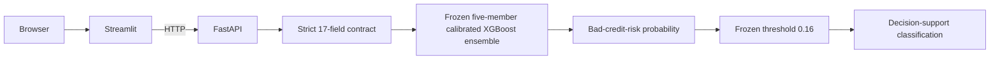

# CreditScope

[](https://github.com/afnanbirahim/creditscope-ml-platform/actions/workflows/ci.yml?query=branch%3Amain)

**An explainable, cost-sensitive credit-risk decision-support system demonstrating
a governed machine-learning lifecycle—from dataset provenance and nested model
selection through calibration, frozen holdout evaluation, explainability,
FastAPI/Streamlit packaging, Docker, and end-to-end CI.**

CreditScope is a portfolio, educational, and research reference implementation.
It estimates good/bad credit risk; it does **not** approve loans, determine
eligibility, provide financial advice, or replace human review.

## At a glance



| Release-candidate fact | Value |
|---|---|
| Model | Fixed untuned XGBoost |
| Calibration | Five-fold sigmoid, `ensemble=True` |
| Governed predictors | 17 |
| Audit-only exclusions | `personal_status_sex`, `age_years`, `foreign_worker` |
| Frozen threshold | 0.16 |
| Demonstration cost | `5 * false_negative + false_positive` |
| Final holdout | 200 rows, evaluated once after policy freeze |
| API / model versions | `creditscope-api-1.0.0` / `creditscope-model-1.0.0` |

## Why this project is technically interesting

- Source semantics were audited before modeling; corrected UCI documentation
  changed preprocessing assumptions without silently changing datasets.
- Model-family comparisons share deterministic folds and row-level OOF evidence.
- XGBoost tuning used nested CV—and was rejected when honest evidence worsened.
- Calibration and threshold selection were evaluated as a nested decision policy.
- The complete policy was frozen before a one-time final holdout evaluation.
- SHAP explains the five actual ensemble members, with calibrated-probability
  caveats and source-feature aggregation.
- A strict, hash-verified artifact powers one inference layer, API, UI, Linux
  containers, golden fixtures, and hosted CI.

See the [architecture and evidence hierarchy](docs/architecture.md) and the
[methodology](docs/methodology.md).

## Final frozen policy

The immutable release-candidate policy is:

- Stage 3R preprocessing: `duration_months` and transformed `credit_amount` are
  quantitative; 15 categorical/discretized fields are one-hot encoded.
- Fixed Stage 4 `XGBClassifier`: 300 trees, depth 3, learning rate 0.05,
  subsample/column sample 0.8, histogram tree method, `random_state=42`.
- `CalibratedClassifierCV(method="sigmoid", ensemble=True)` using the exact five
  persisted development folds.
- Arithmetic mean of five calibrated member probabilities.
- Bad credit risk when calibrated probability is greater than or equal to 0.16.

The threshold reflects an explicit demonstration cost that treats a missed
bad-risk case as five times as costly as flagging a good-risk case. This 5:1 ratio
is a project assumption—not an empirically established lending-industry standard
or a universally optimal threshold.

## One-time final holdout result

These are the predefined Stage 7 metrics for the single frozen policy on the
sealed 200-row holdout. They were not used to revise the policy.

| Metric | Result |
|---|---:|
| ROC-AUC | 0.804643 |
| Average precision | 0.679212 |
| Precision, bad credit risk | 0.398496 |
| Recall, bad credit risk | 0.883333 |
| F1 | 0.549223 |
| Balanced accuracy | 0.655952 |
| Specificity | 0.428571 |
| Brier score | 0.152338 |
| Log loss | 0.475878 |
| Accuracy | 0.565000 |

Confusion counts were TN 60, FP 80, FN 7, and TP 53. The assumed cost was
`5 × 7 + 80 = 115`, or 0.575 per holdout observation.

The low threshold produced high bad-risk recall at the cost of 80 false positives
and modest specificity. That is the intended trade-off under the stated cost,
not evidence that low accuracy is inherently acceptable or that the policy is
suitable for real lending. See the
[frozen evaluation report](reports/stage7/final_evaluation_summary.md).

## ML lifecycle and evidence

1. **Provenance and semantics:** verify UCI ID 144; use ID 573 only to correct
   legacy semantic documentation.
2. **Understanding:** EDA, data dictionary, leakage review, and feature governance.
3. **Baseline:** locked 80/20 split, dummy model, and remediated Logistic Regression.
4. **Comparison:** paired development OOF evaluation of LR, RF, and XGBoost.
5. **Nested tuning:** tune XGBoost honestly; retain the untuned candidate when the
   tuning procedure worsens primary and policy evidence.
6. **Decision policy:** select calibration by Brier score and threshold by 5:1
   cost using development data only; freeze everything.
7. **Final evaluation:** access the holdout once for the frozen policy.
8. **Post-hoc governance:** explain and audit without reopening development.
9. **Productization:** package one trusted artifact behind strict inference,
   FastAPI, Streamlit, separate containers, and CI.

The [release provenance](docs/release_provenance.md) records immutable hashes and
keeps the final release commit/tag pending.

## Explainability and responsible AI

Tree SHAP explains each underlying XGBoost member's **raw-margin score**. It is
not a direct decomposition of sigmoid calibration, averaging across five members,
or the final calibrated probability. Explanations and observed associations are
not causal effects.

The three audit-only attributes never enter prediction. Their exclusion does not
establish fairness: checking/savings status, employment, housing, property, job,
and telephone may retain socioeconomic proxy information. Development-OOF
subgroup diagnostics are limited by small and absent groups, compound historical
coding, and a dataset that cannot represent modern protected-group concepts.

- [Model card](reports/stage8/model_card.md)
- [Explainability report](reports/stage8/explainability_report.md)
- [Responsible-AI audit](reports/stage8/responsible_ai_audit.md)
- [Modeling governance](docs/modeling_governance.md)

## Quick start with Docker

Prerequisites: Git and Docker Desktop or Docker Engine with Compose.

```powershell
git clone https://github.com/afnanbirahim/creditscope-ml-platform.git
Set-Location creditscope-ml-platform
docker compose build
docker compose up --detach --wait --no-build
docker compose ps
```

Open:

- Streamlit: `http://127.0.0.1:8501`
- FastAPI: `http://127.0.0.1:8000`
- Swagger/OpenAPI: `http://127.0.0.1:8000/docs`

Use the committed development-derived example:

```powershell
$body = Get-Content examples/api_single_request.json -Raw
Invoke-RestMethod -Method Post -Uri http://127.0.0.1:8000/predict `
  -ContentType application/json -Body $body
```

Stop cleanly:

```powershell
docker compose down --volumes --remove-orphans
```

The UI calls FastAPI over HTTP and never contains or loads the model. The API
image loads the unchanged Windows-created artifact, which was validated on Linux
against golden predictions within `1e-12`. See the
[container guide](docs/containers.md).

## Local development

The validated model environment is Python 3.12.0. From PowerShell:

```powershell
python -m venv .venv
.\.venv\Scripts\Activate.ps1
python -m pip install -e ".[dev,api,ui]"
python -m pip check
python -m ruff check .
python -m compileall -q -f src tests scripts
python -m pytest
python -m creditscope.container_verify
```

Run services in two terminals:

```powershell
# Terminal 1
.\.venv\Scripts\python.exe -m uvicorn creditscope.api:app --host 127.0.0.1 --port 8000

# Terminal 2
.\.venv\Scripts\python.exe -m streamlit run src/creditscope/ui.py `
  --server.address 127.0.0.1 --server.port 8501
```

The [API contract](docs/api.md), [inference contract](docs/inference_contract.md),
and [frontend guide](docs/frontend.md) describe strict inputs, outputs, errors,
and privacy behavior.

## CI and reproducibility

GitHub Actions runs quality checks, the complete test suite, frozen-evidence
verification, golden inference, API/UI tests, both Docker builds, Linux loading
of the canonical model, Compose health, and end-to-end parity. It neither
rebuilds the model nor deploys services. See [CI documentation](docs/ci.md).

Stochastic modeling uses `random_state=42` where supported. Raw identity, split,
fold, policy, model, OOF, and final-evaluation artifacts are hash-verified. Model
artifacts use pickle semantics and must be loaded only from trusted sources after
integrity verification.

## Repository map

```text
artifacts/model/   Frozen model, manifest, schema, and golden fixtures
data/              Ignored raw/derived data locations
docs/              Architecture, methodology, governance, and runbooks
examples/          Schema-valid API and inference examples
notebooks/         Reproducible stage narratives
reports/           Versioned empirical and governance evidence
src/creditscope/   Data, modeling, inference, API, and UI modules
tests/             Unit, integrity, API, UI, and infrastructure tests
docker/            Exact runtime requirements and CI constraints
```

## Documentation

- [Architecture and evidence hierarchy](docs/architecture.md)
- [Methodology](docs/methodology.md)
- [Modeling governance](docs/modeling_governance.md)
- [Data dictionary](docs/data_dictionary.md)
- [Statlog semantic audit](docs/statlog_semantics_audit.md)
- [Model artifact](docs/model_artifact.md)
- [API](docs/api.md) and [frontend](docs/frontend.md)
- [Containers](docs/containers.md) and [CI](docs/ci.md)
- [Interview guide and demo](docs/interview_guide.md)
- [Release checklist](docs/release_checklist.md)
- [Release provenance](docs/release_provenance.md)
- [Changelog](CHANGELOG.md)

## What this project does not prove

CreditScope does not demonstrate regulatory compliance, deployment readiness for
real lending, fairness across legally protected groups, causal relationships,
temporal robustness, robustness to population drift, business profitability,
operational monitoring, real-world cost calibration, suitability for individual
lending decisions, or representativeness of modern borrowers.

The dataset is small, historical, geographically specific, and incomplete as a
modern credit-risk evidence base. There is no external or temporal validation.
Any real use would require contemporary representative data, independent
validation, jurisdiction-specific legal and impact review, authenticated and
monitored infrastructure, privacy/security assessment, human oversight, and
meaningful recourse.

## Dataset attribution

The modelling data are the UCI Machine Learning Repository's
[Statlog (German Credit Data), ID 144](https://archive.ics.uci.edu/dataset/144/statlog%2Bgerman%2Bcredit%2Bdata),
DOI [10.24432/C5NC77](https://doi.org/10.24432/C5NC77). The target is documented
as good/bad credit risk—not observed loan default.

[South German Credit, ID 573](https://archive.ics.uci.edu/dataset/573/south%2Bgerman%2Bcredit),
DOI [10.24432/C5QG88](https://doi.org/10.24432/C5QG88), supplies corrected semantic
guidance because UCI identifies significant errors in the older coding notes. It
does not replace the ID 144 modelling records.

## Maintenance and use

This repository is a portfolio/educational reference implementation, not an
actively operated service. It offers no SLA, uptime commitment, support promise,
security certification, lending approval, or financial advice.

No software license has yet been selected. Until the repository owner makes and
documents that decision, public visibility should not be interpreted as a grant
of reuse rights beyond applicable law and third-party dataset terms.

