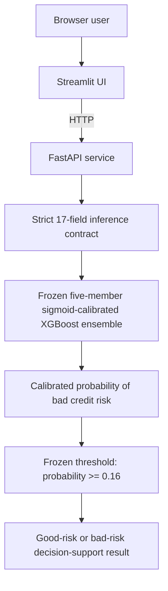
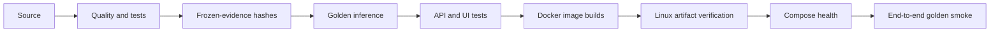

# CreditScope architecture and evidence hierarchy

## Runtime architecture

The UI neither loads the model nor applies a threshold. It obtains model
metadata and prediction results from FastAPI. The API owns validation and calls
the Stage 9 inference layer, which verifies and loads only the trusted bundled
joblib artifact. Users cannot submit artifact paths or serialized objects.

The canonical artifact is immutable for this release candidate. Docker startup
loads it; Docker and CI never train or rebuild it. The artifact was created on
Windows and then loaded unchanged on Linux, where its SHA-256, architecture, and
development-derived golden predictions were verified.

## Container architecture

Compose runs two non-root services on a user-defined bridge. Streamlit reaches
FastAPI by service name at `http://api:8000`. Host ports 8000 and 8501 bind only
to `127.0.0.1`. Both services use read-only root filesystems, temporary `/tmp`,
and `no-new-privileges`. The UI image contains no model artifact or scientific
inference stack.

## CI flow

CI has read-only repository permission, requires no secrets, uploads no borrower
or holdout data, publishes no image, and performs no deployment or retraining.

## Evidence hierarchy

| Level | Purpose | Principal evidence |
|---|---|---|
| Development | Data understanding, semantics, baselines | Stages 1–3R reports and tests |
| Model selection | Compare model families and tuning procedures | Stage 4 paired OOF evidence; Stage 5 nested CV |
| Frozen policy | Select calibration and cost-sensitive threshold without holdout use | Stage 6 nested policy OOF, policy JSON, threshold search |
| One-time holdout | Evaluate one already-frozen policy once | Stage 7 metrics, confusion matrix, predictions, access record |
| Production artifact | Package that policy for deterministic inference | Stage 9 joblib, manifest, schema, golden fixtures |
| Runtime engineering | Preserve inference through API, UI, and Linux containers | Stages 10–12 tests and external Docker validation |
| Hosted validation | Reproduce checks on GitHub-hosted Linux | Green `.github/workflows/ci.yml` at Stage 13 entry |

Stage 4 identified the fixed untuned XGBoost as the strongest candidate. Stage 5
used nested CV and found that tuning did not justify replacing it. Stage 6 chose
sigmoid calibration and threshold 0.16 using development evidence, then froze
the complete policy. Stage 7 accessed the holdout once. Later engineering and
explainability work may document the result but cannot optimize from it.

## Consequential decisions

- Audit UCI semantics before modeling; retain ID 144 as data and use ID 573 for
  corrected semantic guidance.
- Exclude `personal_status_sex`, `age_years`, and `foreign_worker` from prediction
  while retaining them as audit-only attributes.
- Lock one stratified development/holdout split and deterministic CV folds.
- Establish dummy and Logistic Regression baselines before RF/XGBoost comparison.
- Reject nested tuning when honest OOF evidence worsened.
- Select sigmoid calibration by development-only Brier score.
- Select threshold 0.16 under the explicit `5 * FN + FP` demonstration cost.
- Freeze before one-time holdout access.
- Package five calibrated members behind a strict hash-verifying loader.
- Keep API inference separate from UI presentation.
- Validate the Windows artifact unchanged on Linux with golden fixtures and CI.

## Version policy

- **PATCH:** documentation or infrastructure fixes that preserve inference
  semantics.
- **MINOR:** backward-compatible product or API features that preserve the frozen
  model-policy semantics.
- **MAJOR:** breaking API changes or a newly governed model policy.

A changed model, feature set, calibration method, or threshold requires a new
model version and a separately governed evaluation; it must never silently
replace `creditscope-model-1.0.0`.

## Threat and misuse summary

| Risk | Status | Control or limitation |
|---|---|---|
| Use as automated lending approval | Partially mitigated | Explicit prohibited-use language and neutral outputs; governance cannot prevent downstream misuse |
| Untrusted deserialization | Mitigated in supplied service | Fixed bundled path and SHA-256 verification; joblib remains unsafe for untrusted files |
| User-supplied artifact path | Mitigated | No request field or upload endpoint accepts a path or pickle |
| Malformed or oversized payload | Mitigated | Strict schema, semantic validation, and batch limit 100 |
| Public exposure without authentication | Out of scope | Local loopback demo only; authentication and internet hardening are not implemented |
| Historical-data or proxy misuse | Partially mitigated | Model card, audit exclusions, proxy register, and explicit external-validity limits |
| Stale policy assumptions or drift | Out of scope | No operational monitoring claim; real use would require new governance and validation |

These controls are portfolio engineering evidence, not a security certification.

