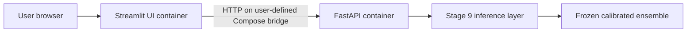

# Containerized local demonstration

## Status

Stage 12 defines separate Linux containers for the existing FastAPI and
Streamlit services. The definitions do not retrain, rebuild, or reserialize the
model. External Docker Desktop validation and the GitHub-hosted Linux workflow
both passed before Stage 13. Docker remains unavailable inside the Codex sandbox,
so the commands below are the reproducible validation path.

## Architecture



The UI image contains no model artifact, joblib, XGBoost, SHAP, training data,
or holdout data. The API image contains the hash-verified Stage 9 model package
and only the application modules required for inference. Neither container
performs fitting at startup.

## Runtime dependencies

`Dockerfile.api` starts from `python:3.12.0-slim-bookworm` and installs the exact
inference/API versions in `docker/requirements-api.txt`. The scientific stack is
NumPy 2.5.3, SciPy 1.18.1, pandas 2.3.3, scikit-learn 1.4.2, XGBoost 3.4.1, and
joblib 1.6.0. FastAPI 0.141.1, Pydantic 2.13.5, and Uvicorn 0.52.4 provide the
HTTP service. SHAP is deliberately absent.

`Dockerfile.ui` installs only HTTPX 0.28.1 and Streamlit 1.63.0. Both images run
as a non-root `creditscope` user, use a read-only root filesystem under Compose,
mount a temporary `/tmp`, and apply `no-new-privileges`.

## Build and run

From the repository root in normal PowerShell:

```powershell
docker build --file Dockerfile.api --tag creditscope-api:1.0.0 .
docker build --file Dockerfile.ui --tag creditscope-ui:1.0.0 .
docker compose build
docker compose up --detach --wait --no-build
docker compose ps
```

Local URLs:

- Streamlit: `http://127.0.0.1:8501`
- FastAPI: `http://127.0.0.1:8000`
- Swagger: `http://127.0.0.1:8000/docs`

Stop the stack cleanly:

```powershell
docker compose logs --no-color --tail 200
docker compose down --volumes --remove-orphans
```

## Canonical-model Linux gate

The critical cross-platform check loads the unchanged Windows-created joblib
artifact inside the Linux API image. It verifies its SHA-256, trusted manifest,
model version, exact 17-field contract, threshold 0.16, sigmoid calibration,
`ensemble=True`, five members, fixed XGBoost parameters, and all development-only
golden fixtures. Probability tolerance is `1e-12`; classes, labels, threshold,
and model version must be exact.

```powershell
docker run --rm creditscope-api:1.0.0 python -m creditscope.container_verify
```

The complete guarded workflow is:

```powershell
.\scripts\manual_docker_validation.ps1
```

It builds both images, confirms non-root users and UI isolation, runs the Linux
model gate, checks standalone API routes, launches Compose, checks service health
and UI-to-API networking, runs golden end-to-end parity, prints logs, and tears
the stack down.

## Health behavior

The API image and Compose health check call `GET /health`; they do not invoke the
model. The UI health check uses Streamlit's `/_stcore/health`. Compose starts the
UI only after the API is healthy. The UI calls the API at `http://api:8000` on a
private user-defined Compose bridge and never falls back to local inference.
Host-published API and UI ports are restricted to `127.0.0.1`.

## Build-context and data boundary

`.dockerignore` is an allow-list. Only Docker definitions, pinned runtime
requirements, necessary application modules, and the four canonical Stage 9
model-package files enter the context. Raw/development/holdout data, reports,
notebooks, tests, environments, Git metadata, caches, and local work directories
are excluded. No Docker socket, privileged mode, credentials, arbitrary artifact
upload, or user-controlled pickle path is present.

## Troubleshooting

- If a port is occupied, stop the conflicting local process; do not change model
  policy to work around it.
- If model verification fails on Linux, preserve the output and stop. Do not
  build a replacement Linux model.
- Use `docker compose ps` and `docker compose logs --no-color --tail 200` for
  service diagnostics.
- Run `docker compose down --volumes --remove-orphans` after a failed attempt
  before retrying a purely infrastructure-related failure.
